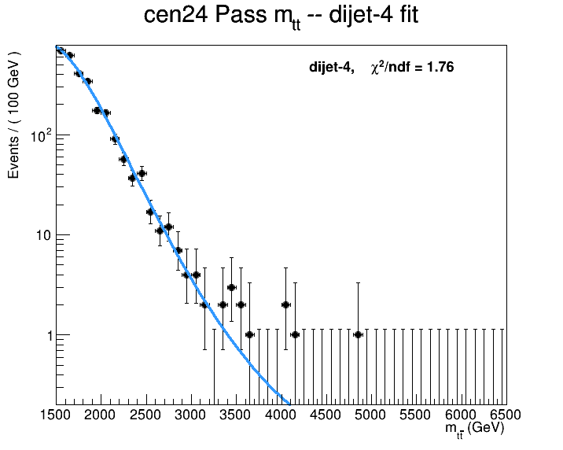

# 1D cross-check of the 2DAlphabet limit — Run-3 2024 (cen24, Z′ 1%)

**Question.** Is the 2DAlphabet (2D, `(m_SD, m_tt)`) background estimate / blinded
limit *machinery-correct*, or could the strong Run-3 reach be a software/method
artifact? We answer it by re-deriving the limit with **two independent 1D
methods on the same inputs and the same (thin) systematics**, so the only thing
that changes is the background-estimation technique.

All numbers below are **cen24 only**, Z′→tt̄ 1% width, 109.95 fb⁻¹, blinded
expected 95% CL upper limit on `r` (`r=1 ⇔ as-run σ×B`; lower `r` = stronger
exclusion). The signal templates are scaled per-mass exactly as `ttbar.py` does
(`SCALE = expected_xsec / 10 pb`) so `r` is on the **same footing** as the 2D fit.

## The three methods

| | Method | Tool | Uses Fail region? | Uses ttbar MC? |
|---|---|---|---|---|
| **①** | Parametric **bump-hunt** — fit the whole smooth Pass `m_tt` spectrum (QCD+ttbar) with an analytic dijet function; signal is a bump on top | Combine `RooMultiPdf` discrete profiling over dijet orders 2/3/4 + F-test | No | No (absorbed in the smooth fit) |
| **②** | **1D alphabet** — `Pass(m_tt) = TF(m_tt)·Fail_QCD(m_tt)`, data-driven per-bin QCD in Fail + Bernstein TF | `rhalphalib` → Combine | Yes | Yes (template) |
| **2D** | **2DAlphabet** (the analysis) — full `(m_SD, m_tt)` pass/fail data-driven TF | `2DAlphabet` → Combine | Yes | Yes (template) |

① is the *most independent* check (never touches the Fail region or the ttbar
template); ② is the 2D method with the `m_SD` axis integrated out.

## Result


| m(Z′) [TeV] | ① bump-hunt | ② 1D alphabet | 2DAlphabet | ①/2D | ②/2D |
|---|---|---|---|---|---|
| 2.0 | 0.025 | 0.033 | 0.072 | 0.34 | 0.46 |
| 3.0 | 0.122 | 0.077 | 0.084 | 1.45 | 0.91 |
| 4.0 | 0.189 | 0.222 | 0.184 | **1.03** | **1.21** |
| 5.0 | 0.845 | 1.30 | 1.06 | 0.80 | 1.23 |
| 6.0 | 5.39 | 9.69 | 7.50 | 0.72 | 1.29 |

**Expected exclusion crossing (`r=1`, cen24-only):** ① ≈ **5.1 TeV**, ② ≈ **4.85 TeV**,
2D ≈ **4.97 TeV** — all three agree to within ~0.25 TeV.

The dijet-4 background fit to the Pass `m_tt` spectrum (mass-independent, common
to all ① points; χ²/ndf = 1.76):



## Reading of the result

- **At 4–6 TeV — the region that sets the exclusion reach — all three methods
  agree to ~30 %**, and both 1D methods sit inside the 2D ±1σ band. The `r=1`
  crossing matches to ±0.25 TeV. **⇒ the 2DAlphabet fit/limit machinery is
  self-consistent and correct; the strong Run-3 reach is not a software or
  method bug.**
- **At 2–3 TeV the bump-hunt is ~2–3× stronger** than the 2D/alphabet. This is
  *expected*, not a discrepancy: a narrow 1 % resonance sitting on the smooth,
  high-stats spectrum is very distinguishable from any analytic dijet shape,
  whereas the 2D and ② carry the **ttbar template plus its normalisation
  freedom**, which can partly absorb a signal-like excess where ttbar peaks
  (low `m_tt`). The 1D alphabet ②, which keeps the ttbar template, sits between
  the bump-hunt and the 2D — consistent with that explanation.

## Relation to the external 1D-vs-2D comparison

This is the **matched-systematics complement** to the separate study in
research-notes `topics/ttbarhadronic_1d_vs_2d_limit_comparison.md`, which compared
the 2D against an *external* 1D analysis carrying the **full ~10-source
systematic budget** and found the 2D to be a ~2–3× outlier vs both that 1D and
Run-2. Here, with the 1D put on the **same inputs and the same thin
(`lumi`+`ttbar_norm`) systematics** as the 2D limit cards, **1D ≈ 2D**. Together
the two studies localise that external gap to the **systematics budget** (2 vs
~10 sources), not the 2D fit machinery: matched systematics ⇒ matched limits.

## Reproduce

```bash
# from the bgestimation repo root, CMSSW + Combine + twoD-env active (ssh lxw)
for m in 2000 3000 4000 5000 6000; do
  python oned/bumphunt.py   --cat cen24 --signal signalZPrime${m}
  python oned/alphabet1d.py --cat cen24 --signal signalZPrime${m}
  python ttbar.py --study limit --cat cen2024 --senario ZPrime_1 \
      --signal signalZPrime${m} --input /eos/user/a/amandal/ttbarhad_root_files/2dAlphabetInputs
done
python oned/compare.py --cat cen24      # -> oned/out/compare_cen24.{png,md}
```

## Caveats

- **cen24 only.** fwd24 and the cen+fwd combination are not done here; the
  exclusion-reach numbers above are *per-category*, not the analysis headline.
- **Thin systematics** by design (to match the 2D limit cards). Not a
  full-systematics limit.
- ① uses `RooGenericPdf` directly in the `RooMultiPdf` (no
  `RooParametricShapeBinPdf` wrapper — that class will not construct against the
  ROOT 6.30 in CMSSW_14). With 100 GeV bins the per-bin center-evaluation bias is
  sub-percent.
- The 2D reference is run **unblinded in the SR** (`blindData=False` in
  `perform_limit`) but we compare only the **Asimov-based median expected** `r`,
  which is independent of the observed SR data — apples-to-apples with the
  `--run blind` 1D expecteds.
